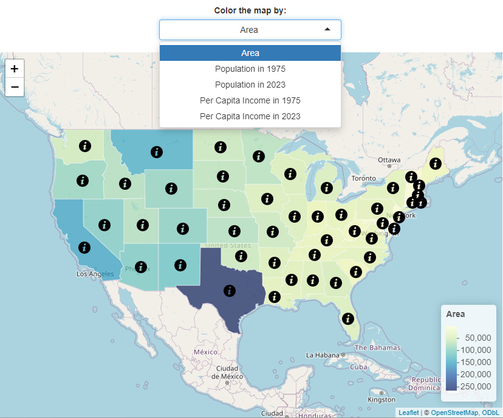
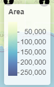
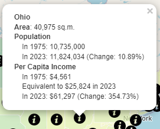
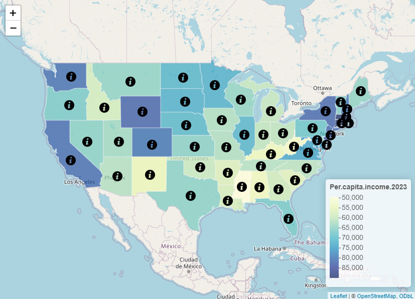

```{r setup, include=FALSE}
knitr::opts_chunk$set(echo = FALSE)
library(priceR)
```

## State differences
This application will display a map of the continental United States during 2 time periods - 1975 and 2023.  
{width=40% style="float:right; margin-left:1px;"}
  
The dropdown box will allow you to select the color based on the data for:  
- the area of each state  
- the population of each state in 1975 and in 2023  
- the per capita income in each state in 1975 and 2023  
  
The map will be updated automatically based on your selection.

{width=100px style="float:left; margin-right:10px;"}If you hover over a state, 
its name will pop-up for easier identification.  

## Understanding the data
{width=100px style="float:left; margin-right:10px;"}You can understand the 
meaning of each color by looking at the legend on the bottom right of the map.  
The numbers will change depending on your dropdown box selection, but the color scheme will stay the same.  

{width=40% style="float:right; margin-left:1px;"}
In addition to the information that was color coded, the pop-up will include some calculated values:  
- the change in the state population  
- the adjusted 1975 income in 2023 dollars  
- the change in the income from 1975 to 2023  

## 2023 dollars
The inflation adjustment for the 2023 dollars is done with the **priceR** package. If we want to figure out
the value of $100 in 1975 dollars adjusted for the year 2023, we can run the following code:


<div style="font-size: 50%">
```{r inflation, echo=T, eval=F}
country <- "US"
inputvalue <- 100
originalYear <- 1975
adjustedYear <- 2023
answer <- adjust_for_inflation(inputvalue, 
                               originalYear, 
                               country, 
                               adjustedYear)
```
</div>

```{r inflationCalc, echo=F, include=F, eval=T}
country <- "US"
inputvalue <- 100
originalYear <- 1975
adjustedYear <- 2023
answer <- adjust_for_inflation(inputvalue, 
                               originalYear, 
                               country, 
                               adjustedYear)
```

This helps us get the following answer:  
**$`r inputvalue` in `r originalYear`** in `r country` is equivalent 
to **$`r format(round(answer, 2), big.mark = ",", nsmall = 2)`** in **`r adjustedYear`** due to inflation. 

## Use the app
You can find this Shiny app with more documentation in my repository on the <a href='https://a-n-n-a-l.shinyapps.io/shiny/'>Shiny server</a>. 
  
The *server.R* and *ui.R* files are available in my <a href='https://github.com/a-n-n-a-l/shiny'>GitHub</a> repository.  
  
    
<div style="text-align: center;">
  
</div>
